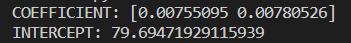
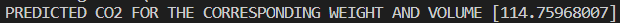

# Implementation of Multivariate Linear Regression
## Aim
To write a python program to implement multivariate linear regression and predict the output.
## Equipment’s required:
1.	Hardware – PCs
2.	Anaconda – Python 3.7 Installation / Moodle-Code Runner
## Algorithm:
### Step1
<br>Import pandas and linear model (from sklearn)

### Step2
<br>Assign the variables x and y as the Weight and volume, CO2

### Step3
<br>Find the regression using regr = linear_model.LinearRegression()

### Step4
<br>USe fit(x,y)

### Step5
<br>Print the output

## Program:
```
Multivariate linear regression
Name: Barath S
Register no: 22008643
```
```python 
import pandas as pd
from sklearn import linear_model
df = pd.read_csv("car.csv")
x = df[['Weight','Volume']]
y = df['CO2']
regr = linear_model.LinearRegression()
regr.fit(x,y)
print("Coefficient:",regr.coef_)
print("Intercept:",regr.Intercept_)
predictedCO2 = regr.predict([[3300,1300]])
print("Predicted CO2 for the corresponding weight and volume",predictedCO2)
```

## Output:



## Insert your output:



## Result
Thus the multivariate linear regression is implemented and predicted the output using python program.